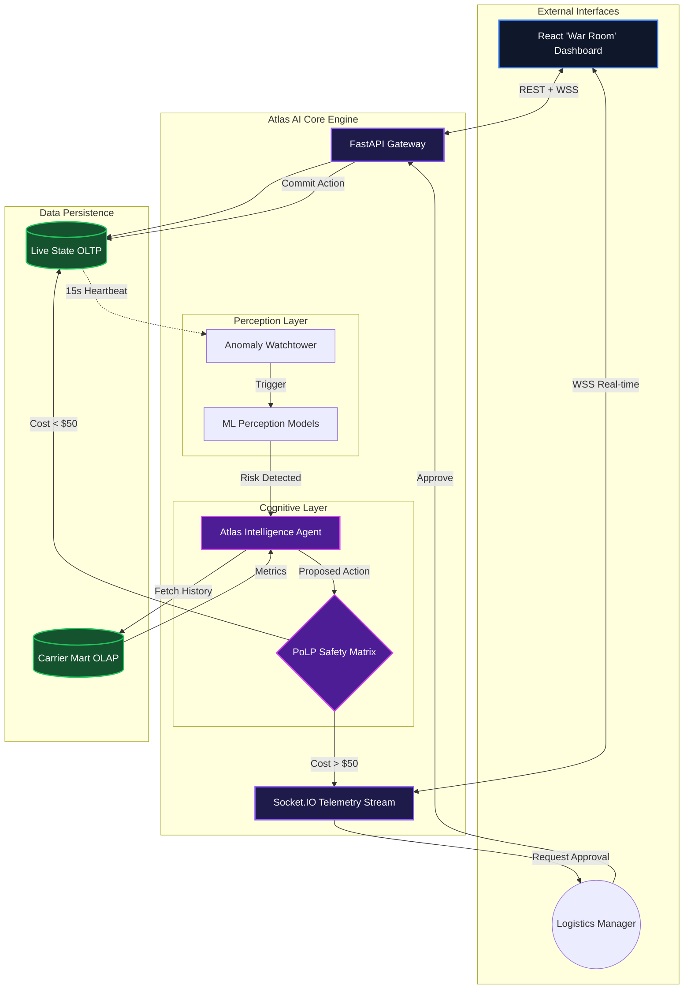

<div align="center">
  
# 🛰️ Atlas AI: Autonomous Logistics Control Tower

**The next-generation intelligence layer for predictive supply chain management.**

[](https://python.org)
[](https://fastapi.tiangolo.com/)
[](https://aws.amazon.com/apprunner/)
[](https://docker.com)

Atlas AI continuously monitors global shipments, predicts cascading risks using Machine Learning, and autonomously negotiates carrier rerouting via Cognitive LLM Agents—all while keeping humans in the loop for high-risk financial decisions.

</div>

---

## 🧠 The "Observe, Reason, Act" Loop

Atlas AI breaks away from traditional static rule-engines. It operates on a continuous Perception-Action loop designed to preemptively eliminate supply chain friction.

### 1. Perception (Machine Learning)
The engine ingests a simulated 15-second heartbeat containing thousands of shipment states.
* **ETA Prediction**: Random Forest models dynamically forecast arrival delays based on real-time port congestion.
* **Anomaly Detection**: Scikit-learn Isolation Forests identify statistically abnormal throughput drops that human operators miss.
* **Risk Classification**: Multi-factor logistic regression flags shipments at risk of SLA breaches.

### 2. Reasoning (Cognitive Agent)
When an anomaly triggers the Watchtower, Atlas transitions from ML to LLM.
* **Context Gathering**: Querying DuckDB (OLAP) for historical carrier reliability.
* **Strategic Planning**: Anthropic/OpenRouter LLMs analyze the crisis and calculate the optimal rerouting strategy, prioritizing timeline versus cost constraints.

### 3. Action (Execution & PoLP)
Atlas operates under the **Principle of Least Privilege (PoLP)**.
* **Autonomous Execution**: If a reroute costs under $50, the agent executes the DB transaction instantly.
* **Human-in-the-Loop**: If the cost breaches the unapproved threshold, the system streams its reasoning to the dashboard and throws a hard block until a manager clicks "Approve."

---

## 🏗️ System Architecture

Our hybrid architecture isolates high-speed state management (OLTP) from intensive analytical queries (OLAP).



---

## 🛠️ Technology Stack

| Component | Technology | Purpose |
| :--- | :--- | :--- |
| **API Gateway** | `FastAPI` | High-performance async routing and REST endpoints. |
| **Realtime Telemetry** | `python-socketio` | Heavy-duty WebSockets for streaming LLM thoughts. |
| **Live Database** | `SQLite` | Ultra-fast local OLTP for sub-millisecond shipment tracking. |
| **Data Warehouse** | `DuckDB` | Vectorized in-process SQL OLAP for instant carrier analytics. |
| **Machine Learning** | `scikit-learn` | Predictive Risk, ETA Forecasting, and Anomaly Detection. |
| **Cognitive Agent** | `OpenRouter` | Universal LLM translation layer for complex reasoning. |
| **Infrastructure** | `Docker` & `AWS` | Multi-stage, `linux/amd64` hardened container for App Runner. |

---

## 📡 API Deep Dive

Atlas AI communicates via dual-channel protocols to maintain UI responsiveness while executing heavy workloads.

### Command & Control (REST)
| Method | Endpoint | Description |
| :--- | :--- | :--- |
| `GET` | `/health` | Container orbital health check. |
| `GET` | `/api/state` | Retrieves the global ground-truth JSON (Warehouses & Shipments). |
| `POST` | `/api/chaos/inject` | Instantly drops a warehouse's throughput to simulate crisis. |
| `POST` | `/api/action/approve`| Cryptographically fires an agent's deferred, high-cost action. |

### Telemetry Stream (WebSockets)
| Event Name | Direction | Payload Description |
| :--- | :--- | :--- |
| `sync_state` | `Engine -> UI` | Massive 15s global state refresh. |
| `metrics_update` | `Engine -> UI` | Live stats (ML Inferences, LLM Calls, Chaos counts). |
| `agent_status` | `Engine -> UI` | Realtime status of the engine loop (e.g., "Scanning for Anomalies"). |
| `watchtower_alert` | `Engine -> UI` | Instant alert that the ML models spotted an anomaly. |
| `agent_stream` | `Engine -> UI` | Matrix-style streaming text of the LLM's thought process. |
| `approval_required` | `Engine -> UI` | Halts execution. Pushes the proposed decision object for review. |

---

## 🚀 Quick Start Guide

### Option 1: Docker (Production Grade)
For a pristine environment identical to AWS App Runner.

```bash
# 1. Clone & create environment file
cp .env.example .env
# -> Edit .env and insert your OPENROUTER_API_KEY

# 2. Build the hardened image
docker build -t atlas-ai .

# 3. Launch the container
docker run -p 8000:8000 --env-file .env atlas-ai
```

### Option 2: Local Development
For rapid iteration and debugging.

```bash
# 1. Setup Virtual Environment
python3 -m venv venv
source venv/bin/activate

# 2. Install Dependencies
pip install -r requirements.txt

# 3. Configure Secrets
cp .env.example .env

# 4. Boot the Atlas Engine
uvicorn app.main:socket_app --port 8000 --reload
```

## 🧪 Simulating Chaos

Once the server is running on `http://localhost:8000`, open a new terminal and run the test suite to watch the engine handle a cascading failure:

```bash
python test.py
```

*You will observe the simulation inject chaos, the Watchtower alert the agent, the Agent formulate a plan, and the final action execution.*

---

<div align="center">
  <b>Built for scale. Hardened for the cloud. Powered by Intelligence.</b>
</div>
